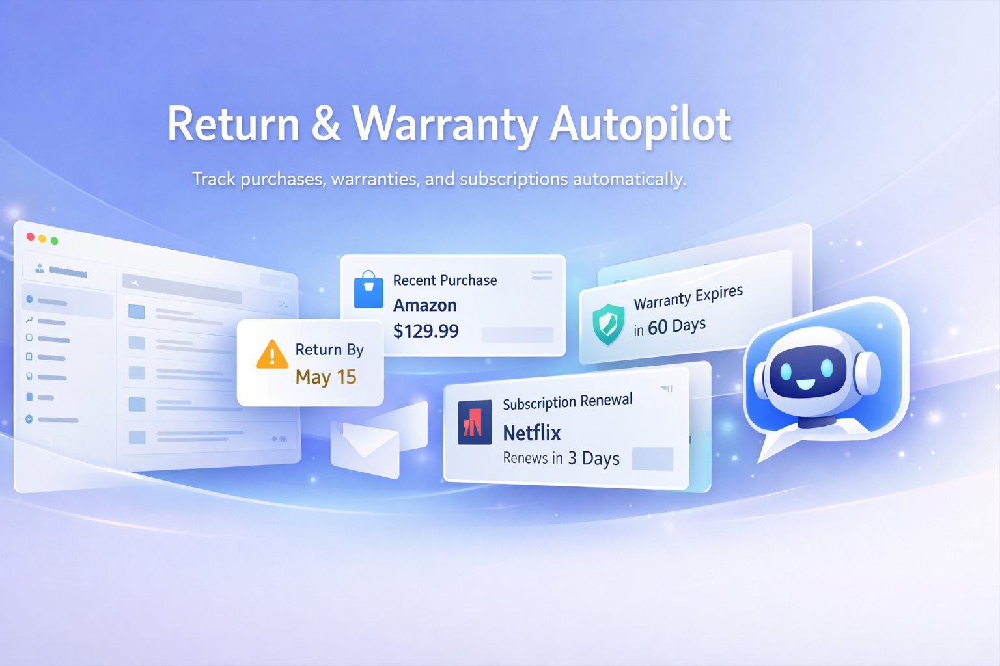

# Return & Warranty Autopilot



AI assistant to track purchase receipts, return windows, and warranty deadlines, then generate claim emails fast.

## Overview

Return & Warranty Autopilot helps users:

- Sync purchase-related emails (Gmail with demo fallback)
- Classify and extract structured order details
- Track return and warranty deadlines automatically
- Generate return/refund/warranty email drafts
- Run completely local using SQLite for demos/hackathons

## Core Features

- Landing page for product onboarding
- Dashboard with key deadline metrics
- Purchases table with search and pagination
- Purchase detail page with claim generator
- Gmail sync focused on purchase-like emails only
- Rule-based email classification:
  - `purchase_confirmation`
  - `shipping_update`
  - `invoice`
  - `subscription`
  - `promotion`
  - `other`
- OpenAI extraction with safe fallback:
  - mock extraction for demo/known emails
  - heuristic extraction on quota/billing/auth/network failures

## Tech Stack

- Next.js 15 (App Router)
- TypeScript
- TailwindCSS
- Prisma ORM
- SQLite (`prisma/dev.db`)

## Local Setup

1. Install dependencies:

```bash
npm install
```

2. Create environment file:

```bash
copy .env.example .env
```

3. Ensure SQLite path is set:

```bash
DATABASE_URL="file:./dev.db"
```

4. Run migrations:

```bash
npx prisma migrate dev
```

5. Seed demo data:

```bash
npm run seed
```

6. Start app:

```bash
npm run dev
```

## Routes

- `/` - Landing page
- `/dashboard` - KPI dashboard + recent purchases
- `/purchases` - Purchases list
- `/purchases/[id]` - Purchase details + claim generation
- `/connect/gmail` - Gmail connection and sync view

## Gmail Sync Behavior

Sync is intentionally purchase-focused, not a general inbox sync.

- Targets queries such as:
  - `category:purchases`
  - `subject:(order OR receipt OR invoice OR shipped OR delivered)`
- Tries to exclude promotions/newsletters where possible
- Non-purchase categories are not sent to purchase extraction

## OpenAI Fallback Behavior

If OpenAI is unavailable (`insufficient_quota`, billing/auth/network failures):

- Sync does not fail
- Extraction falls back to mock or heuristic mode
- UI reports that fallback extraction was used

## Demo Mode

Works without Gmail credentials and without OpenAI key.

- Use **Load Demo Data** from dashboard
- Sync emails from `/connect/gmail` in demo mode
- Generate claim emails from purchase detail page

Demo dataset includes:

- Demo purchases
- Demo synced emails
- Demo extraction records
- Demo claims

## API Endpoints

- `GET /api/gmail/auth/start`
- `GET /api/gmail/auth/callback`
- `POST /api/gmail/sync`
- `GET /api/gmail/status`
- `POST /api/demo/load`
- `POST /api/purchases/[id]/recalculate`
- `POST /api/claims/generate`

## Screenshots


## Scripts

- `npm run dev` - Start dev server
- `npm run build` - Production build
- `npm run start` - Start production server
- `npm run seed` - Seed demo data
- `npm run db:migrate -- --name <name>` - Create/apply migration
- `npm run db:generate` - Generate Prisma Client

## Notes

- SQLite DB path: `prisma/dev.db`
- If build fails with `.next/trace` permission error, stop any running Next.js process and retry.
