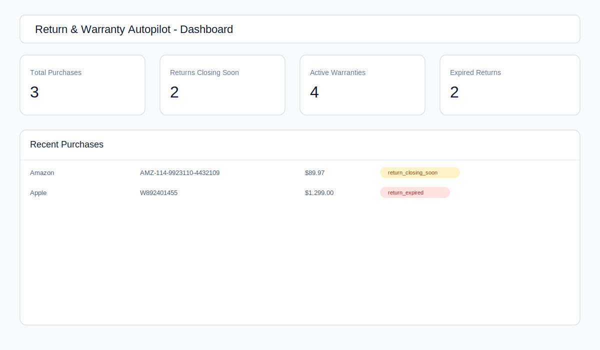
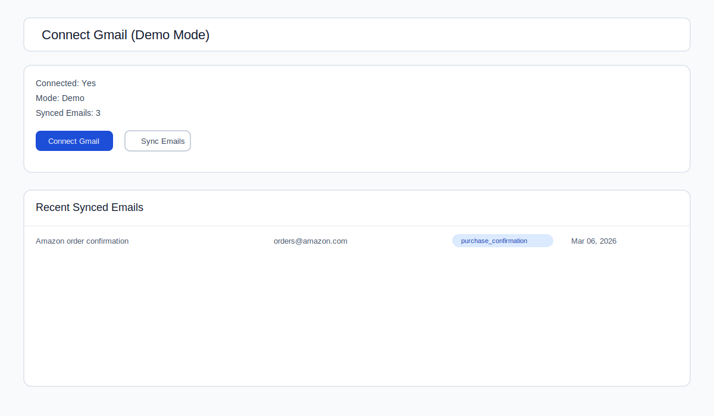
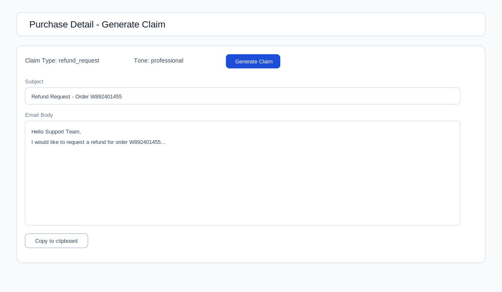

# Return & Warranty Autopilot - Phase 1

Current MVP includes:

- Next.js App Router scaffold with TypeScript and TailwindCSS
- Prisma schema for SQLite (local-first)
- Seed/demo purchase data
- Dashboard + Purchases UI powered by seeded data
- Gmail OAuth + sync API with demo fallback mode
- Purchase email classification + AI extraction pipeline (with mock fallback)
- Deadline recalculation engine + claim generator (AI/template fallback)
- Basic API route handlers

## Tech Stack

- Next.js 15 (App Router)
- TypeScript
- TailwindCSS
- Prisma ORM
- SQLite (local file)

## Quick Start

1. Install dependencies:

```bash
npm install
```

2. Create env file:

```bash
copy .env.example .env
```

3. Ensure `.env` has:

```bash
DATABASE_URL="file:./dev.db"
```

4. Run Prisma migration:

```bash
npx prisma migrate dev
```

5. Seed demo data:

```bash
npm run seed
```

6. Start app:

```bash
npm run dev
```

Visit:

- `/dashboard`
- `/purchases`
- `/purchases/[id]`
- `/connect/gmail`

## Gmail Demo Mode

If `GOOGLE_CLIENT_ID` or `GOOGLE_CLIENT_SECRET` is missing, Gmail runs in demo mode:

- Connect action will mark a demo Gmail account
- Sync action will load sample emails
- HTML email bodies are normalized to plain text for downstream extraction

## Gmail Filtering Scope

Gmail sync is intentionally purchase-focused, not a general inbox sync.

- Query targets purchase-like emails using Gmail search such as:
  - `category:purchases`
  - `subject:(order OR receipt OR invoice OR shipped OR delivered)`
- Promotional/newsletter-like content is de-prioritized/excluded where possible.
- The app is not optimized for non-receipt recurring subscriptions (for example generic Netflix/Spotify billing digests or newsletters) unless they are true purchase receipts.

## Extraction Pipeline

When `/api/gmail/sync` runs, the app executes:

1. Email sync
2. Rule-based classification:
   - `purchase_confirmation`
   - `shipping_update`
   - `invoice`
   - `subscription`
   - `promotion`
   - `other`
3. Only `purchase_confirmation`, `shipping_update`, and `invoice` continue to extraction.
4. Purchase extraction:
   - OpenAI when available
   - fallback to mock/heuristic extraction when OpenAI is unavailable (quota, billing, auth, or network failures)
5. Persistence into `Purchase` and `PurchaseItem`

If OpenAI extraction is unavailable, sync still succeeds and the UI reports that fallback extraction was used.

## Phase 4 APIs

- `POST /api/purchases/[id]/recalculate`
- `POST /api/claims/generate`

## Demo Instructions

Use this flow for hackathon demos even when Gmail and OpenAI are not configured.

1. Set only `DATABASE_URL` in `.env`.
2. Run migrations and start app:
   - `npx prisma migrate dev`
   - `npm run dev`
3. Open `/dashboard`:
   - Demo data auto-loads if there are no purchases.
   - You can re-load/reset demo content anytime with `Load Demo Data`.
4. Open `/connect/gmail` and click `Sync Emails`:
   - Works in demo mode without Gmail credentials.
5. Open any purchase and click `Generate Claim`:
   - Falls back to template generation when `OPENAI_API_KEY` is missing.

Demo includes:

- Demo purchases
- Demo email dataset
- Demo extraction results (merchant/order/item fields + confidence)
- Demo generated claims

### Screenshots





## Scripts

- `npm run dev` - Start development server
- `npm run build` - Production build
- `npm run start` - Start production server
- `npm run seed` - Seed demo data
- `npm run db:migrate -- --name <name>` - Create/apply migration
- `npm run db:generate` - Generate Prisma client
